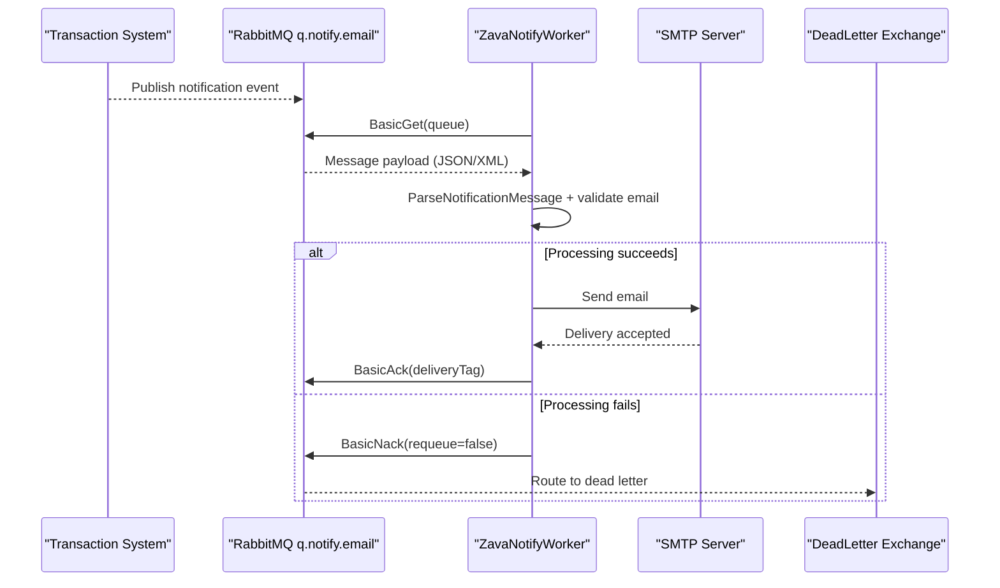

# API & Service Communication Contracts

This application exposes no HTTP API endpoints and functions as a background worker. Communication is asynchronous from RabbitMQ inbound events to SMTP outbound notifications.

## Service Catalog

| Service | Port | Category | Purpose |
|---|---|---|---|
| ZavaNotifyWorker | N/A | Business | Processes notification events and sends emails |
| RabbitMQ | 5672 | Infrastructure | Hosts notification queue and dead-letter exchange |
| SMTP service (Mailhog default) | 1025 | Infrastructure | Receives outbound notification emails |

## API Endpoints Inventory

> ERROR: No recognized API endpoints found at /tmp/workspace/crgarcia12/mnm-ZavaNotifyWorker. Verify the path is correct.

## Management & Observability Endpoints

| Service | Endpoint | Custom Metrics (if any) |
|---|---|---|
| ZavaNotifyWorker | None detected | None detected |

## DTOs & Contracts

The primary contract object is `NotificationMessage`, used as an internal message DTO after JSON/XML deserialization. No OpenAPI, GraphQL, or protobuf contracts were detected.

## Communication Patterns

The worker uses asynchronous queue consumption with `BasicGet` from RabbitMQ, then synchronous SMTP send via `SmtpClient`. Failed processing triggers `BasicNack` with requeue disabled so dead-letter routing can apply. No API gateway, service discovery, TLS-specific configuration, or authentication/authorization controls are configured within this worker process.

## Service Technology Matrix

| Service | Web | Data Access | Discovery | Gateway | Actuator | Cache | Metrics |
|---|---|---|---|---|---|---|---|
| ZavaNotifyWorker | None | RabbitMQ client | None | None | None | None | None |

## Service Communication Sequence

