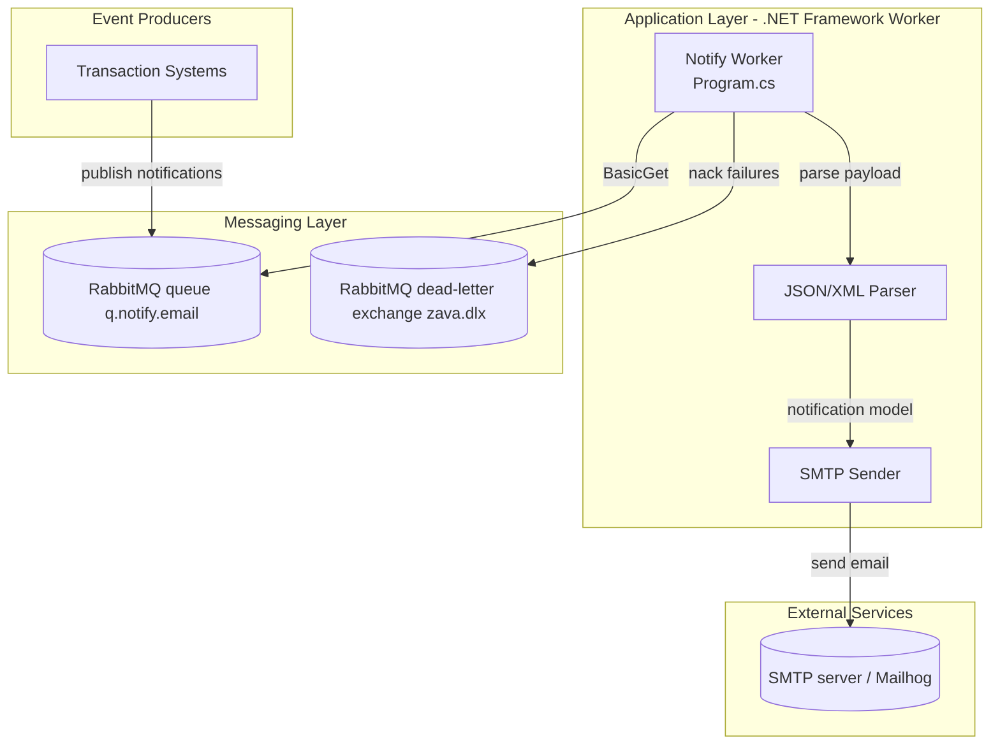
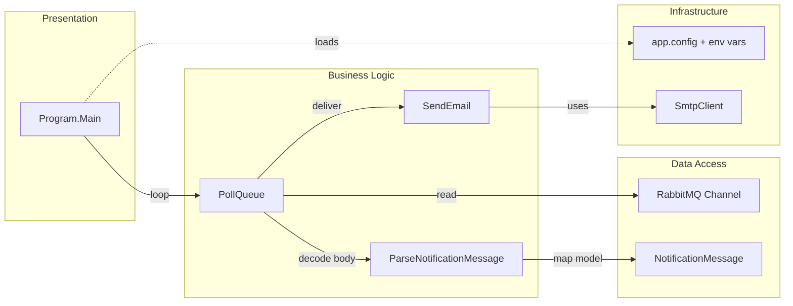

# Architecture Diagram

This repository contains a single worker service that consumes notification events and sends SMTP emails. The architecture is queue-driven with external RabbitMQ and SMTP dependencies.

## Application Architecture

### Technology Stack Summary

| Layer | Technology | Version | Purpose |
|---|---|---|---|
| Runtime | .NET Framework | net48 | Executes worker process |
| Messaging | RabbitMQ.Client | 5.2.0 | Pull and acknowledge queue messages |
| Email | System.Net.Mail | .NET BCL | Deliver notification emails |
| Deployment | Docker + Mono | mono:6.12 | Containerized runtime |

### Data Storage & External Services

The service does not own a database. It integrates with RabbitMQ for inbound messages and an SMTP endpoint for outbound email delivery.

### Key Architectural Decisions

- Uses a polling loop with `BasicGet` and explicit ack/nack for message handling.
- Supports both JSON and XML payload parsing for compatibility.
- Routes failed message processing to a dead-letter exchange via queue arguments.

## Component Relationships

### Component Inventory

| Component | Layer | Type | Responsibility |
|---|---|---|---|
| Program.Main | Presentation | Entry Point | Starts lifecycle and graceful shutdown handling |
| PollQueue | Business Logic | Orchestrator | Pulls messages and controls ack/nack |
| ParseNotificationMessage | Business Logic | Parser | Detects JSON/XML and maps notification fields |
| SendEmail | Business Logic | Notifier | Formats email subject/body and sends message |
| RabbitMQ channel | Data Access | Messaging Client | Declares queue and receives message payload |
| app.config/env | Infrastructure | Configuration | Provides RabbitMQ/SMTP/runtime settings |
