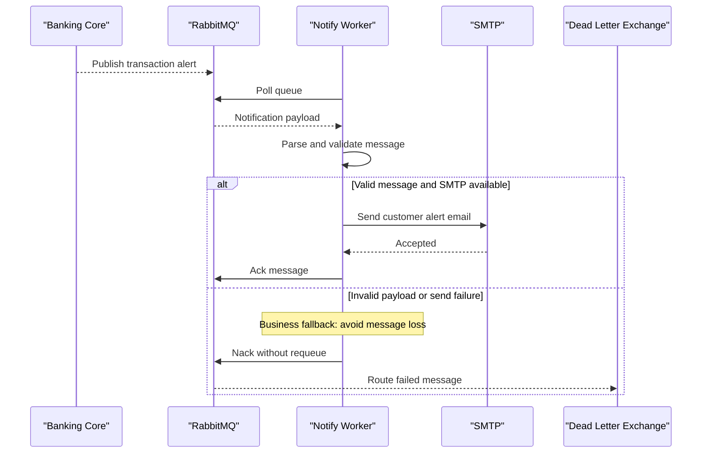

# Core Business Workflows

The application processes banking notification events and delivers customer-facing email alerts. Its core business function is reliable transformation of queue messages into outbound notifications.

## Domain Entities

| Entity | Service / Bounded Context | Description | Key Relationships |
|---|---|---|---|
| NotificationMessage | Notification Processing | Canonical message object for alert content | Consumed from RabbitMQ payload and used to build SMTP message |

## Service-to-Domain Mapping

| Service | Domain Context | Owned Entities | External Dependencies |
|---|---|---|---|
| ZavaNotifyWorker | Notification Processing | NotificationMessage | RabbitMQ queue, SMTP service |

## Primary Workflows

### Workflow 1: Process notification message

1. Worker polls notification queue.
2. If message exists, parse JSON or XML payload into notification model.
3. Validate email recipient presence.
4. Build business email subject/body from alert fields.
5. Send email and acknowledge message; on failure, dead-letter message.

## Cross-Service Data Flows

Transaction systems publish events into RabbitMQ. The worker reads one message per cycle, transforms it into a notification payload, and sends to SMTP. If processing fails, the event is negatively acknowledged and routed to dead-letter exchange, resulting in delayed/manual handling rather than immediate customer notification.

## Business Workflow Sequence

## Business Rules & Decision Logic

- Message format rule: XML payloads are parsed by XML reader; non-XML payloads are parsed as JSON.
- Required data rule: missing customer email prevents delivery and triggers failure path.
- Reliability rule: successful processing must ack; failures must nack with dead-letter routing.
- Error handling is local to poll cycle so worker continues processing subsequent messages.
