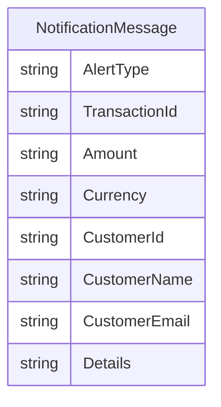

# Data Architecture & Persistence Layer

The application does not persist domain data in an internal database. Its data layer is an in-memory message transformation pipeline from queue payload to email content.

## Database Configuration

| Service/Module | DB Type | Profile | Driver | Connection | Migration Tool |
|---|---|---|---|---|---|
| ZavaNotifyWorker | None | N/A | N/A | N/A | None |

## Data Ownership per Service

| Service | Tables Owned | ORM Framework | Caching | Notes |
|---|---|---|---|---|
| ZavaNotifyWorker | None | None | None | Processes transient notification payloads only |

## Entity Model

## Key Repository Methods

| Service | Repository | Notable Methods | Purpose |
|---|---|---|---|
| ZavaNotifyWorker | None | None | No repository/data-access abstraction present |

## Caching Strategy

No cache provider or cache-aside/read-through strategy was detected.

## Data Ownership Boundaries

The service has no owned datastore; it consumes messages from RabbitMQ and emits emails via SMTP. No cross-service database access or CQRS pattern is implemented.

### Data Classification & Sensitivity

| Entity | Sensitive Fields | Classification (PII/PHI/PCI/None) | Controls in Place |
|---|---|---|---|
| NotificationMessage | CustomerName, CustomerEmail, CustomerId | PII | No explicit encryption-at-rest or masking in this service |
