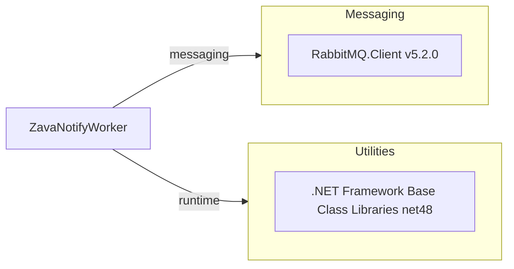

# Dependency Map

This project declares a small dependency set centered on messaging and base .NET runtime libraries.

## Dependencies

### Dependency Summary

| Category | Count | Key Libraries | Notes |
|---|---:|---|---|
| Messaging | 1 | RabbitMQ.Client 5.2.0 | Queue read + ack/nack operations |
| Utilities | 1 | .NET Framework BCL | Includes XML/SMTP/serialization APIs |

### Version & Compatibility Risks

`RabbitMQ.Client` 5.2.0 and target framework `net48` indicate a legacy runtime posture that may require package and API compatibility validation during modernization.

### Notable Observations

- External package footprint is minimal (single declared NuGet dependency).
- Messaging and SMTP are implemented mostly with framework classes and one AMQP client.
- No dedicated observability, resilience, or security libraries are declared.

## Test Dependencies

No test-scoped dependencies were detected from build/package files.

Total test-scope dependencies: 0
No integration/unit test dependency declarations were found.
