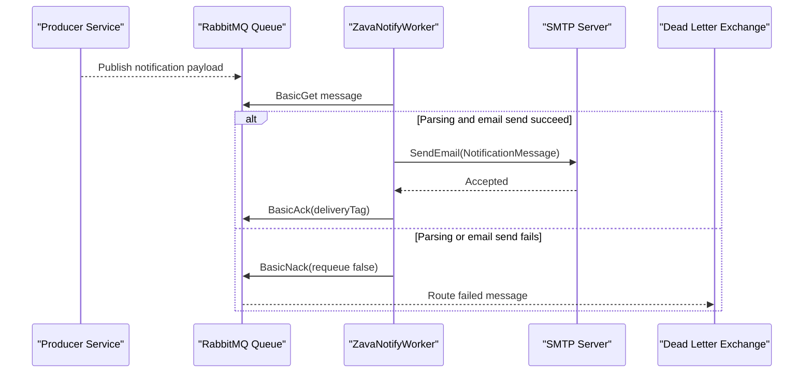

# API & Service Communication Contracts

This worker exposes no HTTP API surface; its external contract is a queue-consumption interface and SMTP delivery behavior.

## Service Catalog

| Service | Port | Category | Purpose |
|---|---|---|---|
| ZavaNotifyWorker | N/A | Business | Consumes notification events and sends emails |

## API Endpoints Inventory

> ERROR: No recognized API endpoints found at /tmp/workspace/crgarcia12/mnm-ZavaNotifyWorker. Verify the path is correct.

## Management & Observability Endpoints

| Service | Endpoint | Custom Metrics (if any) |
|---|---|---|
| ZavaNotifyWorker | None | None |

## DTOs & Contracts

`NotificationMessage` is the core contract model used internally after parsing inbound JSON/XML payloads. It represents request content from the queue and drives the outbound email content.

## Communication Patterns

The worker uses synchronous pull-based messaging against RabbitMQ (`BasicGet`) and synchronous SMTP send operations. There are no explicit retry/circuit breaker frameworks configured in code; failures result in negative acknowledgement to dead-letter handling. No TLS/auth/authz controls are enforced at an HTTP API level because no HTTP endpoints exist.

## Service Technology Matrix

| Service | Web | Data Access | Discovery | Gateway | Actuator | Cache | Metrics |
|---|---|---|---|---|---|---|---|
| ZavaNotifyWorker | None | RabbitMQ client | None | None | None | None | Console logs only |

## Service Communication Sequence

