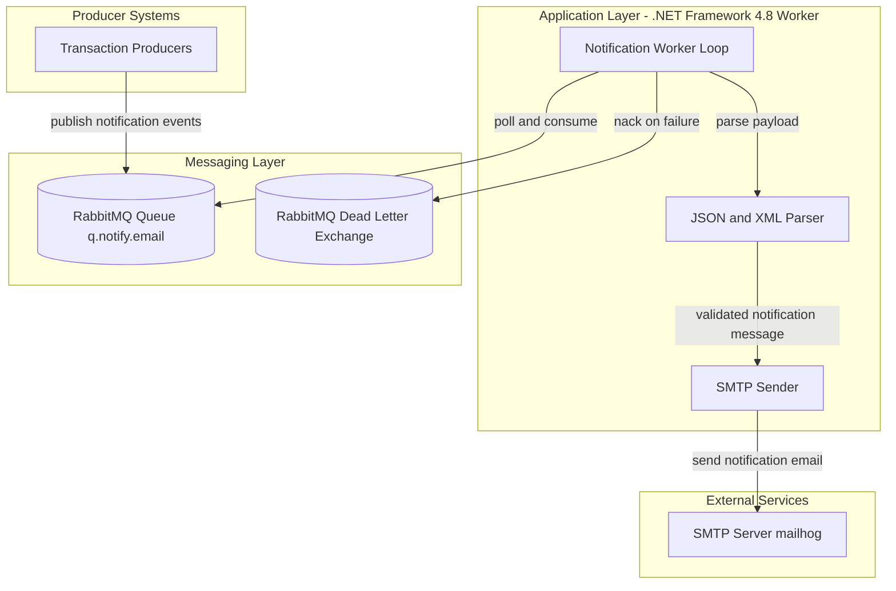
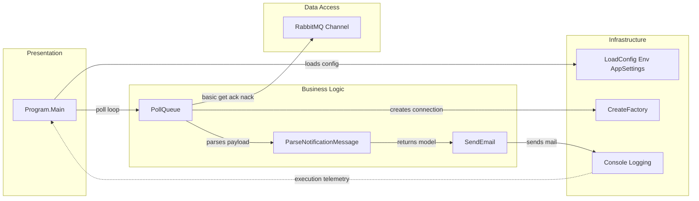

# Architecture Diagram

This worker application processes queued notification events and sends outbound emails. The architecture is a single-process background service with messaging and SMTP integrations.

## Application Architecture

### Technology Stack Summary

| Layer | Technology | Version | Purpose |
|---|---|---|---|
| Runtime | .NET Framework Console App | v4.8 | Background worker host |
| Messaging | RabbitMQ.Client | 5.2.0 | Queue polling and ack/nack handling |
| Configuration | app.config + environment variables | N/A | Runtime settings and overrides |
| Integration | System.Net.Mail SMTP | .NET BCL | Email notification delivery |

### Data Storage & External Services

The application uses RabbitMQ as its durable message source and dead-letter flow target. It integrates with an SMTP host for outbound message delivery and does not persist domain data in a database.

### Key Architectural Decisions

- Uses pull-based queue consumption (`BasicGet`) with manual acknowledgements for explicit success/failure handling.
- Supports dual message formats (JSON and XML) to absorb producer variability.
- Prioritizes simple deployment by keeping all processing in a single worker process.

## Component Relationships

### Component Inventory

| Component | Layer | Type | Responsibility |
|---|---|---|---|
| Program.Main | Presentation | Entry Point | Starts worker lifecycle and signal handlers |
| LoadConfig | Infrastructure | Config Loader | Binds environment/appSettings values |
| CreateFactory | Infrastructure | Connection Factory | Builds RabbitMQ connection settings |
| PollQueue | Business Logic | Orchestrator | Retrieves messages and controls ack/nack |
| ParseNotificationMessage | Business Logic | Parser Router | Chooses JSON or XML parser path |
| ParseJson / ParseXml | Business Logic | Translators | Converts payload into NotificationMessage |
| SendEmail | Business Logic | Integration Service | Sends SMTP messages to recipients |
| RabbitMQ Channel | Data Access | Message Client | Queue declare/get/ack/nack operations |
