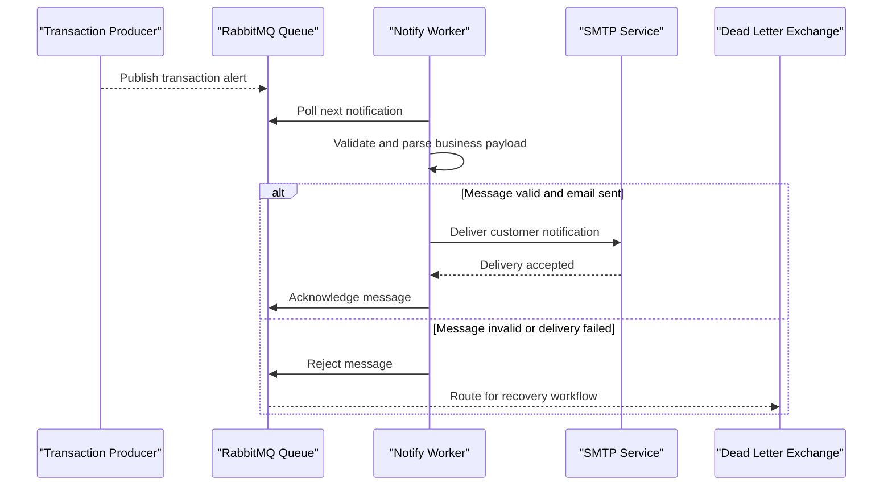

# Core Business Workflows

The application handles financial notification events by converting incoming queue messages into customer-facing emails. Its core business process is reliable notification dispatch with dead-letter fallback on failure.

## Domain Entities

| Entity | Service / Bounded Context | Description | Key Relationships |
|---|---|---|---|
| NotificationMessage | ZavaNotifyWorker / Notification Processing | Canonical business message for alert delivery | Produced by upstream systems, consumed by worker |
| Customer | Upstream Producer Domain | Message origin context carrying customer identity | Referenced by notification payload |
| Transaction Alert | Upstream Producer Domain | Event triggering customer notification | Enriched into outbound email content |

## Service-to-Domain Mapping

| Service | Domain Context | Owned Entities | External Dependencies |
|---|---|---|---|
| ZavaNotifyWorker | Notification Delivery | NotificationMessage processing state | RabbitMQ queue, SMTP server |

## Primary Workflows

### Workflow 1: Process Notification Event

A producer publishes an alert message to RabbitMQ. The worker polls the queue, parses JSON/XML payloads into a notification model, sends an email, and acknowledges the message when successful.

### Workflow 2: Failure and Dead-Letter Routing

If parsing or SMTP delivery fails, the worker rejects the message without requeue. RabbitMQ routes the failed event to the configured dead-letter exchange for downstream inspection/recovery.

## Cross-Service Data Flows

The worker consumes producer-owned event data from RabbitMQ and does not call other internal services directly. Business degradation behavior is implemented through dead-letter routing: failed events are preserved for later handling instead of being silently dropped.

## Business Workflow Sequence

## Business Rules & Decision Logic

The worker applies format-based parsing rules (XML vs JSON), requires non-empty payload input, and treats successful SMTP transmission as the completion criterion. Failed processing triggers a deterministic dead-letter path to preserve event integrity.
