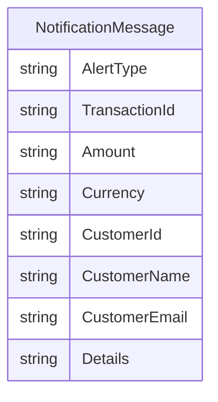

# Data Architecture & Persistence Layer

The application has no relational or document database persistence layer. Its primary data contract is an in-memory notification model parsed from queue payloads.

## Database Configuration

| Service/Module | DB Type | Profile | Driver | Connection | Migration Tool |
|---|---|---|---|---|---|
| ZavaNotifyWorker | None | Default | N/A | N/A | None |

## Data Ownership per Service

| Service | Tables Owned | ORM Framework | Caching | Notes |
|---|---|---|---|---|
| ZavaNotifyWorker | None | None | None | Stateless worker with queue-mediated processing |

## Entity Model

## Key Repository Methods

| Service | Repository | Notable Methods | Purpose |
|---|---|---|---|
| ZavaNotifyWorker | None | None | No repository/data-access abstraction layer |

## Caching Strategy

No application-level caching provider or cache policy is configured.

## Data Ownership Boundaries

Data is exchanged through RabbitMQ messages and transformed in memory within a single service boundary. There is no shared database, no isolated service database, and no cross-service direct data-store access.

### Data Classification & Sensitivity

| Entity | Sensitive Fields | Classification (PII/PHI/PCI/None) | Controls in Place |
|---|---|---|---|
| NotificationMessage | CustomerName, CustomerEmail, CustomerId | PII | No explicit encryption or masking configured in code |
