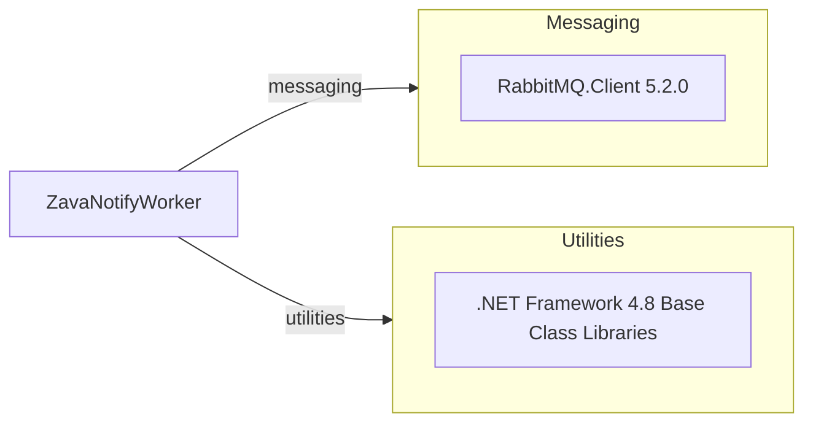

# Dependency Map

This project has one declared external package dependency with framework and platform dependencies provided by .NET Framework.

## Dependencies

### Dependency Summary

| Category | Count | Key Libraries | Notes |
|---|---:|---|---|
| Messaging | 1 | RabbitMQ.Client 5.2.0 | RabbitMQ queue interaction |
| Utilities | 1 | .NET Framework 4.8 BCL | Core runtime APIs (mail, XML, config) |

### Version & Compatibility Risks

The project targets .NET Framework 4.8 and RabbitMQ.Client 5.2.0. Both indicate a legacy runtime/dependency baseline and may require compatibility review for modernization targets.

### Notable Observations

- Dependency surface is intentionally small, minimizing migration complexity.
- Messaging behavior is tightly coupled to RabbitMQ delivery semantics (manual ack/nack).

## Test Dependencies

| Framework | Version | Notes |
|---|---|---|
| None detected | N/A | No test-scoped package dependencies found |

Total test-scope dependencies: 0
No test dependencies detected.
